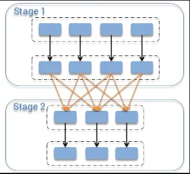
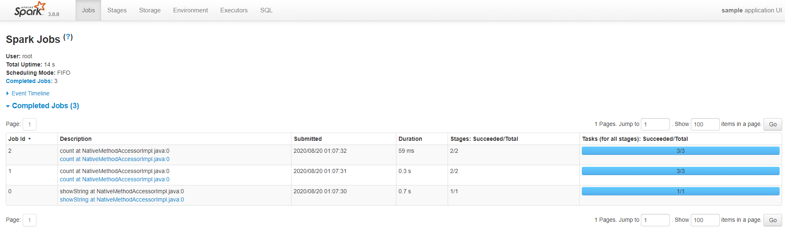

<p align="center">
  <a href="" rel="noopener">
 </a>
 <br>

</p>

<h3 align="center">Spark tutorial</h3>

<div align="center">

[]()
[](https://github.com/da-huin/spark-tutorial/issues)
[](https://github.com/da-huin/spark-tutorial/pulls)
[](/LICENSE)

</div>

---

<p align="center"> 
    <br> Tutorial of Spark.
</p>

## 📝 Table of Contents

- [Getting Started](#getting_started)
- [Acknowledgments](#acknowledgement)

## 🏁 Getting Started <a name = "getting_started"></a>

This document explains how to install Spark and how to basic use it.

### Tutorial

1. **Run Jupyter Notebook docker including Spark.**

    * `4040` port is for `spark UI`.
    * `8080` port is for `Jupyter Lab`.
    ```bash
    docker run -d -v $pwd/workspace:/workspace -p 8888:8888 -p 4040:4040 -it --rm --name lab dahuin000/lab

    docker logs -f lab
    ```

1. **Copy URL in logs and connect your jupyterlab**

    ```
    ...

    To access the notebook, open this file in a browser:
        file:///root/.local/share/jupyter/runtime/nbserver-6-open.html
    Or copy and paste one of these URLs:
        http://eb0f1e427c67:8888/?token=3ba1fcdb7fec3680476b3fa2d8cea155e693a409939a74b8
     or http://127.0.0.1:8888/?token=3ba1fcdb7fec3680476b3fa2d8cea155e693a409939a74b8

    ...
    ```

1. **Go to the wokring directory (/workspace)**

1. **Make practice.ipynb file (/workspace/practice.ipynb)**

1. **Create resources directory and copy files in this `tutorial resources directory`. (/workspace/resources)**

1. **Get Spark Session.**

    ```python
    import findspark
    findspark.init()

    import pyspark
    sc = pyspark.SparkContext(appName="sample")
    spark = pyspark.sql.SparkSession(sc)   
    ```

1. **Create Dataframe**

    ```python
    numbers = spark.range(1000).toDF("number")
    numbers.show(10)
    ```

    * result:

        ```python
        +------+
        |number|
        +------+
        |     0|
        |     1|
        |     2|
        |     3|
        |     4|
        |     5|
        |     6|
        |     7|
        |     8|
        |     9|
        +------+
        only showing top 10 rows
        ```

1. **Write Transformation code**
    
    * `Transformation`: Transformation is performed by collection the actions to be changed. It is called lazy evaluation.

        * `Shuffle`: Exchngae partition in cluster and it has wide dependency.

            


    ```python
    # this code is not evaluate.
    div_numbers = numbers.where("number % 2 = 0")
    ```

1. **Write Action code**

    * `Action`: Execute Transformations.

    ```python
    print("origin numbers: " numbers.count())
    print("div numbers: ", div_numbers.count())
    ```

    * result:
        
        ```python
        origin numbers: 1000
        div numbers: 500        
        ```

1. **Open Spark UI with Browser and Check Jobs**

    You can browse at http://localhost:4040

    

1. **Create DataFrame from csv.**

    ```python
    from pyspark.sql import types

    schema = types.StructType([
        # params: column name, type
        types.StructField("DEST_COUNTRY_NAME", types.StringType()),
        types.StructField("ORIGIN_COUNTRY_NAME", types.StringType()),
        types.StructField("count", types.LongType(), metadata={"hello":"metadata"})
    ])

    df = spark.read.format("csv").option("header", "true").schema(schema).load("resources/2015-summary.csv")

    df.printSchema()
    ```

1. **Check Schema**

    ```python
    df.printSchema()
    ```

    * result:
    
        ```bash
        root
        |-- DEST_COUNTRY_NAME: string (nullable = true)
        |-- ORIGIN_COUNTRY_NAME: string (nullable = true)
        |-- count: long (nullable = true)    
        ```

1. **Check Table**

    ```python
    df.show(5)
    ```

    * result:

        ```bash
        +-----------------+-------------------+-----+
        |DEST_COUNTRY_NAME|ORIGIN_COUNTRY_NAME|count|
        +-----------------+-------------------+-----+
        |    United States|            Romania|   15|
        |    United States|            Croatia|    1|
        |    United States|            Ireland|  344|
        |            Egypt|      United States|   15|
        |    United States|              India|   62|
        +-----------------+-------------------+-----+
        only showing top 5 rows
        ```

1. **Prepare to use DataFrame with SQL.**

    * This code register your dataframe to table.

    ```python
    df.createOrReplaceTempView("country")
    ```


### Reference

1. **What is Spark?**

    1. Spark is set of libraries that process data in parallel in a clustered environment.

    2. Spark usally runs on hadoop, but can also run on others.

    3. Spark API consists of `unstructured API` and `structured API`

1. **What is Different between SparkSession and SparkConetext?**

    ```
    SparkSession = SparkContext + Session Information
    ```

1. **What is Spark DataFrame?**

    It is similar to a `Pandas DataFrame`.

1. **What is Partition?**
    
    It splits the data into chunks so that the executor can perform tasks in parallel.

## **Tutorial is over 😀**
