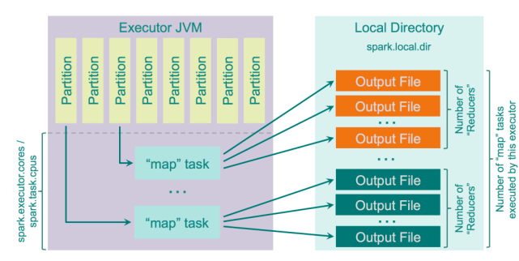

<p align="center">
  <a href="" rel="noopener">
 </a>
 <br>

</p>

<h3 align="center">Spark tutorial</h3>

<div align="center">

[]()
[](https://github.com/da-huin/spark-tutorial/issues)
[](https://github.com/da-huin/spark-tutorial/pulls)
[](/LICENSE)

</div>

---

<p align="center"> 
    <br> Tutorial of Spark. 
</p>

## 📝 Table of Contents

- [Getting Started](#getting_started)
- [Acknowledgments](#acknowledgement)

## 🏁 Getting Started <a name = "getting_started"></a>

* This document explains how to install Spark and how to basic use it.

* This document has been created with reference to the book `Spark The Definitive Guide`.

### **Tutorial**

1. **Run Jupyter Notebook docker including Spark.**

    * `4040` port is for `spark UI`.
    * `8080` port is for `Jupyter Lab`.


    `Linux: `
    ```bash
    docker run -d -v $pwd/workspace:/workspace -p 8888:8888 -p 4040:4040 -it --rm --name lab dahuin000/lab

    docker logs -f lab
    ```

    `Windows`
    ```bash
    docker run -d -v %cd%/workspace:/workspace -p 8888:8888 -p 4040:4040 -it --rm --name lab dahuin000/lab

    docker logs -f lab
    ```    

1. **Copy URL in logs and connect your jupyterlab**

    ```
    ...

    To access the notebook, open this file in a browser:
        file:///root/.local/share/jupyter/runtime/nbserver-6-open.html
    Or copy and paste one of these URLs:
        http://eb0f1e427c67:8888/?token=3ba1fcdb7fec3680476b3fa2d8cea155e693a409939a74b8
     or http://127.0.0.1:8888/?token=3ba1fcdb7fec3680476b3fa2d8cea155e693a409939a74b8

    ...
    ```

1. **Go to the wokring directory (/workspace)**

1. **Make practice.ipynb file (/workspace/practice.ipynb)**

1. **Create resources directory and copy files in this `tutorial resources directory`. (/workspace/resources)**

1. **Get Spark Session.**

    ```python
    import findspark
    findspark.init()

    import pyspark
    sc = pyspark.SparkContext(appName="sample")
    spark = pyspark.sql.SparkSession(sc)   
    ```

1. **Create Dataframe**

    ```python
    numbers = spark.range(1000).toDF("number")
    numbers.show(10)
    ```

    * result:

        ```python
        +------+
        |number|
        +------+
        |     0|
        |     1|
        |     2|
        |     3|
        |     4|
        |     5|
        |     6|
        |     7|
        |     8|
        |     9|
        +------+
        only showing top 10 rows
        ```

1. **Write Transformation code**
    
    * `Transformation`: Transformation is performed by collection the actions to be changed. It is called lazy evaluation.

        * `Shuffle`: Exchngae partition in cluster and it has wide dependency.

            


    ```python
    # this code is not evaluate.
    div_numbers = numbers.where("number % 2 = 0")
    ```

1. **Write Action code**

    * `Action`: Execute Transformations.

    ```python
    print("origin numbers: " numbers.count())
    print("div numbers: ", div_numbers.count())
    ```

    * result:
        
        ```python
        origin numbers: 1000
        div numbers: 500        
        ```

1. **Open Spark UI with Browser and Check Jobs**

    You can browse at http://localhost:4040

    

1. **Create DataFrame from csv.**

    ```python
    from pyspark.sql import types

    schema = types.StructType([
        # params: column name, type
        types.StructField("DEST_COUNTRY_NAME", types.StringType()),
        types.StructField("ORIGIN_COUNTRY_NAME", types.StringType()),
        types.StructField("count", types.LongType(), metadata={"hello":"metadata"})
    ])

    df = spark.read.format("csv").option("header", "true").schema(schema).load("resources/2015-summary.csv")

    df.printSchema()
    ```

1. **Check Schema**

    ```python
    df.printSchema()
    ```

    * result:
    
        ```bash
        root
        |-- DEST_COUNTRY_NAME: string (nullable = true)
        |-- ORIGIN_COUNTRY_NAME: string (nullable = true)
        |-- count: long (nullable = true)    
        ```

1. **Check Table**

    ```python
    df.show(5)
    ```

    * result:

        ```bash
        +-----------------+-------------------+-----+
        |DEST_COUNTRY_NAME|ORIGIN_COUNTRY_NAME|count|
        +-----------------+-------------------+-----+
        |    United States|            Romania|   15|
        |    United States|            Croatia|    1|
        |    United States|            Ireland|  344|
        |            Egypt|      United States|   15|
        |    United States|              India|   62|
        +-----------------+-------------------+-----+
        only showing top 5 rows
        ```

1. **Get data using select function.**

    ```python
    from pyspark.sql.functions import *
    df.select(col("DEST_COUNTRY_NAME")).show(2)
    ```

    * result:

        ```
        +-----------------+
        |DEST_COUNTRY_NAME|
        +-----------------+
        |    United States|
        |    United States|
        +-----------------+
        only showing top 2 rows    
        ```

1. **Get data using SQL from DataFrame.**

    ```python
    # This code register your dataframe to table.
    df.createOrReplaceTempView("country")
    spark.sql("SELECT * FROM country").limit(2).show()
    ```

    * result:

        ```bash
        +-----------------+-------------------+-----+
        |DEST_COUNTRY_NAME|ORIGIN_COUNTRY_NAME|count|
        +-----------------+-------------------+-----+
        |    United States|            Romania|   15|
        |    United States|            Croatia|    1|
        +-----------------+-------------------+-----+
        only showing top 2 rows
        ```

1. **Add Column**

    ```
    df = df.withColumn("number_one", lit(1))
    df.limit(5).show()
    ```

    * result:

        ```
        +-----------------+-------------------+-----+----------+
        |DEST_COUNTRY_NAME|ORIGIN_COUNTRY_NAME|count|number_one|
        +-----------------+-------------------+-----+----------+
        |    United States|            Romania|   15|         1|
        |    United States|            Croatia|    1|         1|
        |    United States|            Ireland|  344|         1|
        |            Egypt|      United States|   15|         1|
        |    United States|              India|   62|         1|
        +-----------------+-------------------+-----+----------+
        only showing top 5 rows
        ```

1. **Rename Column**

    ```python
    df.withColumnRenamed("DEST_COUNTRY_NAME", "dest").columns
    ```

    * result:

        ```
        ['dest', 'ORIGIN_COUNTRY_NAME', 'count', 'number_one']
        ```

1. **Drop Column**

    ```python
    df.drop("DEST_COUNTRY_NAME").columns
    ```

    * result:

        ```
        ['ORIGIN_COUNTRY_NAME', 'count', 'number_one']
        ```


1. **Cast Column Data Type**

    ```python
    df.withColumn("count", col("count").cast("string")).printSchema()
    ```

    * result:

        ```
        root
        |-- DEST_COUNTRY_NAME: string (nullable = true)
        |-- ORIGIN_COUNTRY_NAME: string (nullable = true)
        |-- count: string (nullable = true)
        |-- number_one: integer (nullable = false)
        ```

1. **Split Dataframe randomly**

    ```python
    temp_df = df.randomSplit([0.25, 0.75])

    temp_df[0].count(), temp_df[1].count()
    ```

    * result:

        ```
        (69, 187)
        ```

1. **Append Rows**

    Dataframe has immutability. So we will create a new DataFrame with new rows and merge them.

    ```python
    from pyspark.sql import Row

    new_rows = [
        Row("New Country", "Other Country", 5, 1),
        Row("New Country 2", "Other Country 3", 1, 1)
    ]

    new_df = spark.createDataFrame(new_rows, df.schema)

    df.union(new_df).count(), df.count()    
    ```

    * result:

        ```
        (258, 256)
        ```

1. **Sort Rows**

    ```python
    df.orderBy(col("DEST_COUNTRY_NAME")).limit(5).show()
    df.orderBy(col("count"), col("DEST_COUNTRY_NAME")).limit(5).show()
    ```

    * result:

        ```
        +-------------------+-------------------+-----+----------+
        |  DEST_COUNTRY_NAME|ORIGIN_COUNTRY_NAME|count|number_one|
        +-------------------+-------------------+-----+----------+
        |            Algeria|      United States|    4|         1|
        |             Angola|      United States|   15|         1|
        |           Anguilla|      United States|   41|         1|
        |Antigua and Barbuda|      United States|  126|         1|
        |          Argentina|      United States|  180|         1|
        +-------------------+-------------------+-----+----------+
        only showing top 5 rows

        +-----------------+-------------------+-----+----------+
        |DEST_COUNTRY_NAME|ORIGIN_COUNTRY_NAME|count|number_one|
        +-----------------+-------------------+-----+----------+
        |     Burkina Faso|      United States|    1|         1|
        |    Cote d'Ivoire|      United States|    1|         1|
        |           Cyprus|      United States|    1|         1|
        |         Djibouti|      United States|    1|         1|
        |        Indonesia|      United States|    1|         1|
        +-----------------+-------------------+-----+----------+
        only showing top 5 rows
        ```    

1. **Repartition**

    `Partiton`
    * Each executor can execute on task per each core, and one partition is linked to one task.
    * Too many partitions incur overhead.
    * One Spark executor == One YARN container

    

    ```py
    df.repartition(5)
    df.repartition(col("DEST_COUNTRY_NAME"))
    ```

1. **Collect Row Data to Driver**

    ```py
    df.take(5)
    df.collect() # caution!
    ```

1. **Cache**

    * Cache in memory

    ```py
    df.cache()
    ```

1. **Alias**

    ```py
    df.select(col("count").alias("number")).limit(5).show()
    ```

    * result:
        ```
        +------+
        |number|
        +------+
        |    15|
        |     1|
        |   344|
        |    15|
        |    62|
        +------+
        ```

1. **Count (Aggregation)**

    * This count is transformation. It works only when action is executed.

    ```py
    df.select(count("*")).show()
    df.select(countDistinct("ORIGIN_COUNTRY_NAME")).show()
    ```

    * result:
        ```
        +--------+
        |count(1)|
        +--------+
        |     256|
        +--------+
        +-----------------------------------+
        |count(DISTINCT ORIGIN_COUNTRY_NAME)|
        +-----------------------------------+
        |                                125|
        +-----------------------------------+
        ```

1. **First and Last (Aggregation)**
    
    ```py
    odf = df.sort("ORIGIN_COUNTRY_NAME")
    odf.select(first("ORIGIN_COUNTRY_NAME"), last("ORIGIN_COUNTRY_NAME")).show()
    ```

    * result:
        ```
        +---------------------------------+--------------------------------+
        |first(ORIGIN_COUNTRY_NAME, false)|last(ORIGIN_COUNTRY_NAME, false)|
        +---------------------------------+--------------------------------+
        |                           Angola|                         Vietnam|
        +---------------------------------+--------------------------------+
        ```

1. **Min and Max (Aggregation)**

    ```py
    odf.select(min("count"), max("count")).show()
    ```

    * result:
        ```
        +----------+----------+
        |min(count)|max(count)|
        +----------+----------+
        |         1|    370002|
        +----------+----------+        
        ```

1. **Sum (Aggregation)**

    ```py
    odf.select(sum("count")).show()
    sum("count")
    ```

    * result:
        ```
        +----------+
        |sum(count)|
        +----------+
        |    453316|
        +----------+       
        Column<b'sum(count)'>
        ```

1. **Avg (Aggregation)**

    ```py
    odf.select(avg("count")).show()
    ```

    * result:
        ```
        +-----------+
        | avg(count)|
        +-----------+
        |1770.765625|
        +-----------+
        ```

1. **Group By (Aggregation)**

    ```py
    ddf = df.groupBy("DEST_COUNTRY_NAME").agg(count("*").alias("count"), sum("count").alias("sum"))
    ddf.orderBy(desc("count")).show()    
    ```

    * result:
        ```
        +--------------------+-----+------+
        |   DEST_COUNTRY_NAME|count|   sum|
        +--------------------+-----+------+
        |       United States|  125|411352|
        |              Kosovo|    1|     1|
        |              Sweden|    1|   118|
        |            Anguilla|    1|    41|
        |              Russia|    1|   176|
        |            Paraguay|    1|    60|
        |            Kiribati|    1|    26|
        |              Guyana|    1|    64|
        |            Djibouti|    1|     1|
        |         Philippines|    1|   134|
        |            Malaysia|    1|     2|
        |           Singapore|    1|     3|
        |              Turkey|    1|   138|
        |                Iraq|    1|     1|
        |                Fiji|    1|    24|
        |             Germany|    1|  1468|
        |               Palau|    1|    30|
        |Turks and Caicos ...|    1|   230|
        |              France|    1|   935|
        |              Jordan|    1|    44|
        +--------------------+-----+------+        
        ```

1. **Join**

    1. Create join expression
    ```py
    person = spark.createDataFrame([
        (0, "Bill Chambers", 0, [100]),
        (1, "Matei Zaharia", 1, [500, 250, 100]),
        (2, "Michael Armbrust", 1, [250, 100])
    ]).toDF("id", "name", "graduate_program", "spark_status")

    graduate_program = spark.createDataFrame([
        (0, "Masters", "School of Information", "UC Berkeley"),
        (2, "Masters", "EECS", "UC Berkeley"),
        (1, "Ph.D", "EECS", "UC Berkeley"),
    ]).toDF("id", "degree", "department"," school")

    join_expression = person["graduate_program"] == graduate_program["id"]
    join_expression
    ```

    * result:
        ```
        Column<b'(graduate_program = id)'>
        ```

    1. Join

    ```py
    person.join(graduate_program, join_expression, "inner").select("name", "degree", "department").show()
    ```

    * result:
        ```bash
        +----------------+-------+--------------------+
        |            name| degree|          department|
        +----------------+-------+--------------------+
        |   Bill Chambers|Masters|School of Informa...|
        |   Matei Zaharia|   Ph.D|                EECS|
        |Michael Armbrust|   Ph.D|                EECS|
        +----------------+-------+--------------------+
        ```

### Reference

1. **What is Spark?**

    1. Spark is set of libraries that process data in parallel in a clustered environment.

    2. Spark usally runs on hadoop, but can also run on others.

    3. Spark API consists of `unstructured API` and `structured API`

1. **What is Different between SparkSession and SparkConetext?**

    ```
    SparkSession = SparkContext + Session Information
    ```

1. **What is Spark DataFrame?**

    It is similar to a `Pandas DataFrame`.

1. **What is Partition?**
    
    It splits the data into chunks so that the executor can perform tasks in parallel.

## **Tutorial is over 😀**
